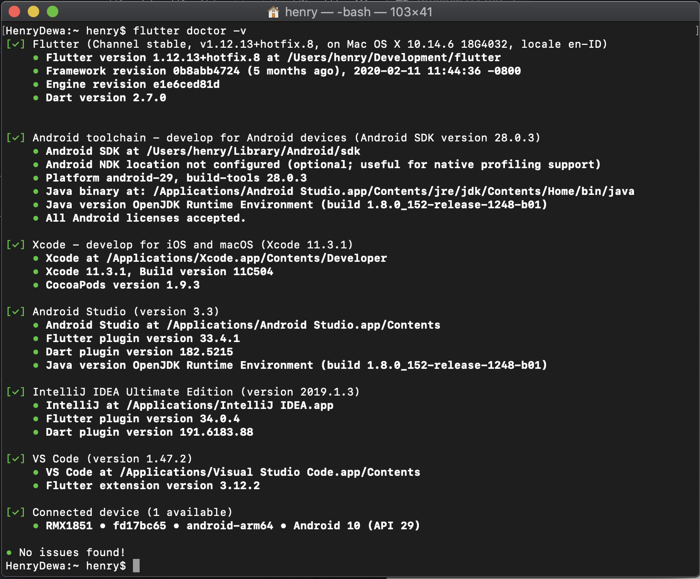

# Tools Yang Dibutuhkan

## Tools

- Flutter SDK & Dart SDK (https://flutter.dev/docs/get-started/install)
- Code Editor (https://flutter.dev/docs/get-started/editor)
  - Android Studio (developer.android.com/studio) 
  - Visual Studio Code (code.visualstudio.com)
- Plugins & Extension Flutter Pada Code Editor
- Emulator
  - Android Virtual Device
  - iOS Simulator (Mac & XCode)

Periksa requirement dengan perintah `flutter doctor -v` pada console.

## Minimun Requirement

OS: MacOS, Windows 7, atau Linux
HDD: 2.8 GB, 1,3GB, 600 MB
RAM: 4 GB (8 GB jika menggunakan emulator)

[&laquo; kembali](README.md) | [lanjut &raquo;](03.md)