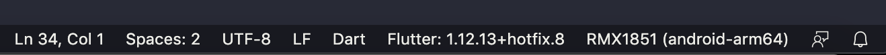

# Struktur Projek Flutter

## Membuat Projek Dengan Android Studio
- Buka IDE atau Code Editor
- Pilih `Start a new Flutter project`.
- Pilih Flutter Application sebagai project type. Lalu klik Next.
- Masukkan nama projek lalu klik next
- Klik Finish

Tunggu Android Studio mempersiapkan projek atau mengunduh pustaka yang dibutuhkan

### Menjalankan Aplikasi

## Membuat Projek Dengan VS Code
- Buka IDE atau VS Code.
- Pilih Menu &#8594; `View` &#8594; `Command Palette`.
- Ketik `flutter`, dan pilih `Flutter: New Project`.
- Masukkan nama projek lalu `enter`.
- Buat atau pilih direktori folder projek.

Tunggu VS Code mempersiapkan projek atau mengunduh pustaka yang dibutuhkan

### Menjalankan Aplikasi

- Perhatikan pada status bar VS Code, dimana Emulator sudah terhubung.

- Pilih Menu &#8594; `Run` &#8594; `Start Debugging` atau tekan F5.
- Tunggu VS Code melakukan proses build dan menjalankan aplikasinya. Proses build dapat di lihat pada `Debug Console`.

[&laquo; kembali](README.md) | [lanjut &raquo;](05.md)