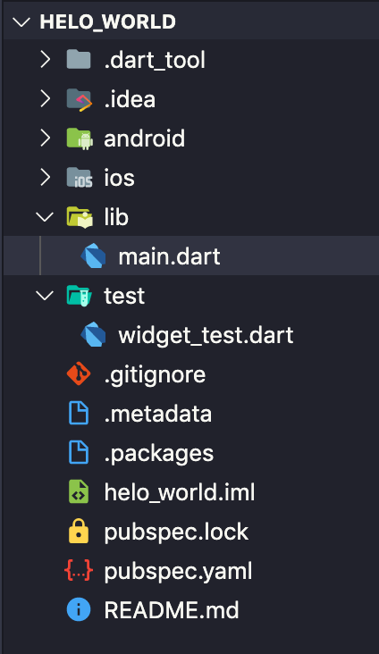

# Struktur Code Flutter
Struktur direktori projek atau dasar code program flutter sangat penting kita pahami, agar memudahkan kita dalam pengembangan aplikasi Flutter.

Berikut struktur code flutter :

Penjelasan : 

* `android` berisi source code untuk aplikasi android
* `iOS` berisi source code untuk aplikasi iOS.
* `lib` berisi source code Dart, di sini kita akan menulis kode aplikasi.
* `test` berisi source code Dart untuk melakukan testing aplikasi.
* `.metadata` merupakan file yang berisi metadata project yang di-generate otomatis;
* `.packages` merupakan file yang berisi alamat package atau library;
* `helo_world.iml` merupakan file XML yang berisi keterangan project;
* `pubspec.lock` merupakan file yang berisi versi-versi library atau package. 
* `pubspec.yaml` merupakan file yang berisi informasi tentang project dan library yang dibutuhkan;
* `README.md` merupakan file markdown yang berisi penjelasan tentang source code.

[&laquo; kembali](README.md) | [lanjut &raquo;](06.md)
