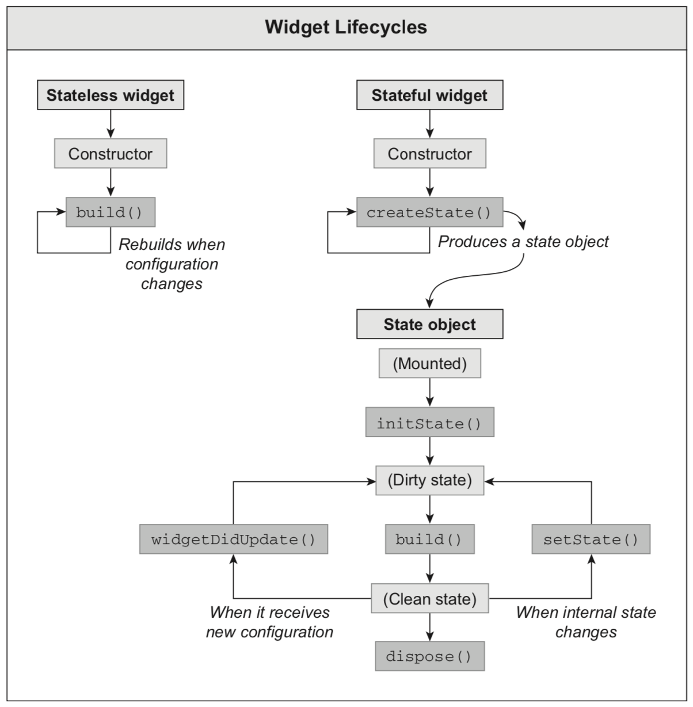

# Stateless & Stateful Widget

Tampilan widget aplikasi ada yang statis dan ada yang dinamis. Widget statis merupakan widget yang dari pertama kali dijalankan tidak memiliki perubahan, sedangkan widget dinamis adalah widget yang ketika runtime bisa mengalami perubahan: misal konten, ukuran, warna dll.

Perbedaan dari kedua widget tersebut adalah karena adanya state. Secara fungsi, state mirip dengan variabel yaitu untuk menampung data, namun perubahan terhadap nilai dari state akan memicu tampilan widget dirender ulang (hal ini tidak berlaku bagi variabel biasa).

Widget statis yang tidak menggunakan state dan di-build hanya dengan konfigurasi yang telah diinisiasi sejak awal disebut dengan **Stateless Widget**, seperti code berikut:

```dart
class NewsList extends StatelessWidget { 
    @override
    Widget build(BuildContext context) {
        return Container(); 
    }
}
```
Kita juga dapat menemukan **Stateless Widget** yang dipakai di widget - widget bawaan dari Flutter seperti Text, Icon, Chip, dsbg.


sedangkan yang dinamis atau menggunakan state disebut dengan **StatefullWidget** contohnya saat pertama kali kita membuat sebuah projek baru, seperti code berikut :

```dart
import 'package:flutter/material.dart';

void main() => runApp(MyApp());

class MyApp extends StatelessWidget {
  // This widget is the root of your application.
  @override
  Widget build(BuildContext context) {
    return MaterialApp(
      title: 'Flutter Demo',
      theme: ThemeData(
        primarySwatch: Colors.blue,
      ),
      home: MyHomePage(title: 'Flutter Demo Home Page'),
    );
  }
}

class MyHomePage extends StatefulWidget {
  MyHomePage({Key key, this.title}) : super(key: key);

  final String title;
  @override
  _MyHomePageState createState() => _MyHomePageState();
}

class _MyHomePageState extends State<MyHomePage> {
  int _counter = 0;

  void _incrementCounter() {
    setState(() {
      _counter++;
    });
  }

  @override
  Widget build(BuildContext context) {
    return Scaffold(
      appBar: AppBar(
        title: Text(widget.title),
      ),
      body: Center(
        child: Column(
          mainAxisAlignment: MainAxisAlignment.center,
          children: <Widget>[
            Text(
              'You have pushed the button this many times:',
            ),
            Text(
              '$_counter',
              style: Theme.of(context).textTheme.display1,
            ),
          ],
        ),
      ),
      floatingActionButton: FloatingActionButton(
        onPressed: _incrementCounter,
        tooltip: 'Increment',
        child: Icon(Icons.add),
      ), // This trailing comma makes auto-formatting nicer for build methods.
    );
  }
}


```

Kita juga dapat menemukan **StatefullWidget** yang dipakai di widget - widget bawaan dari Flutter seperti TextField, Checkbox, Radio, dsbg.




[&laquo; kembali](06.md) | [lanjut &raquo;](08.md)
